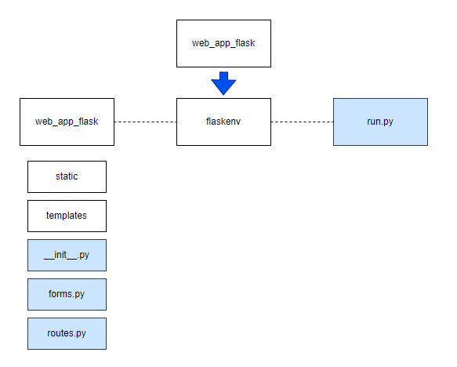

# web_app_flask
sample web application with flask

# Structure

## Enviornment Setup
To get started follow the steps below:

1. Install a virtual environment by runnning the following
```
virtualenv flaskenv
```
※　if virtualenv is not installed yet, run the following command and after that run the above install command again
```
pip install virtualenv
```
then, activate the virtual environment
```
source flaskenv/bin/activate
```

2. Install all the required libraries 
```
pip install flask
```

3. Run the APP to create a Flask front end on port 5000 (or any port the app is pointing to)
```
python run.py
```